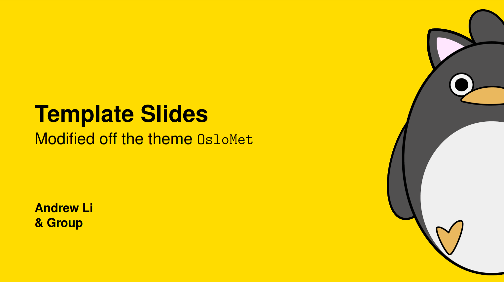
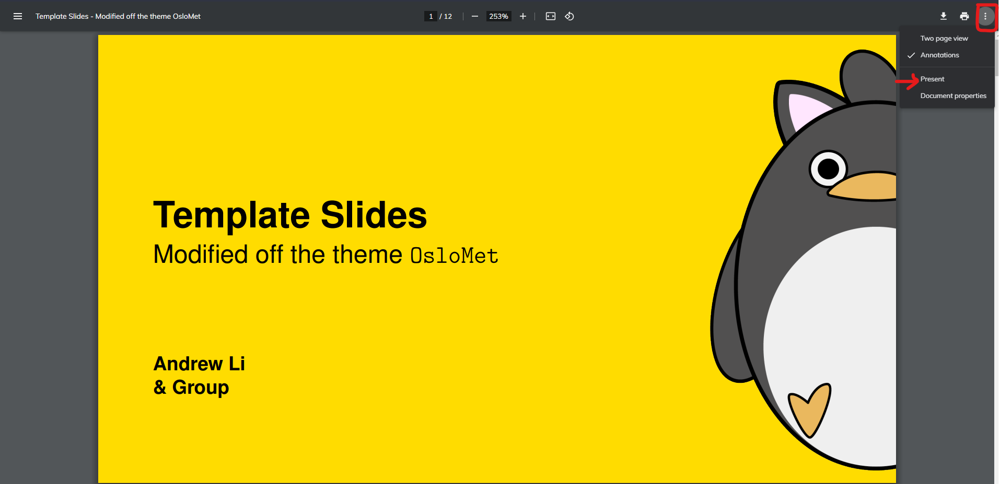
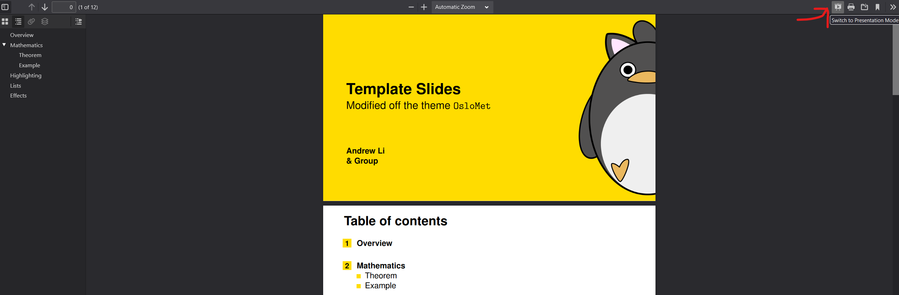

# LaTeX Slideshow Template

A LaTeX slideshow template based on [OsloMet](https://github.com/martinhelso/OsloMet#oslomet)



Contains as slightly less bloated OsloMet Template

## Usage

This is a LaTeX template and will generate the pdf on build (Can be done on [overleaf](overleaf.com)). Once the pdf file is build you can present the slides on a chrome pdf viewer and clicking the three dots and Present (See below)


On Firefox you would open then hit the Switch to Presentation Mode button [slide down icon] (below)


## File Overview

General info on editing the template

* 📁 imgs folder - use to store image files (png, jpg, etc)
* main.tex - the main file to adjust the contents of the slides
* style.sty - dependencies
* beamercolorthemeOsloMet.sty - colors
* beamerfontthemeOsloMet.sty - fonts
* beamerinnerthemeOsloMet.sty - general styles that you don't need to touch if you like the theme (front, section, and block settings)
* beamerouterthemeOsloMet.sty - header and footline and logos
* beamerthemeOsloMet.sty - main controller for all other .sty files


## Logo

The logo in the lower right corner is disable by default to re-enable go to `beamerouterthemeOsloMet.sty:77` and uncomment

The logo in the lower right corner can be removed by default from a specific `frame` using the macro `\hidelogo` outside of the `frame` like this:

```tex
\hidelogo
\begin{frame}
    ...
\end{frame}
```

Use `\showlogo` in the same manner to make the logo appear again.

## Section page

The command `\SectionPage` inserts a `[NoFrameNumbering, plain]` frame with yellow background issuing the `\sectionpage` command. The command `\SectionPage` is used outside of a `frame`, unlike `\sectionpage`.

## Enumerated references

The command `\enumref` inserts a reference to an enumerated item in the shape of a yellow box, like the ones used in the `enumerate` environment.

## Options

Options are given as

```tex
\usetheme[option]{OsloMet}
```

### Widescreen

By default, `beamer` uses the aspect ratio 4:3. You can change this to 16:9 with the option `widescreen`.

### Font

By default, almost all text is typeset in a sans serif. The option `MathSerif` enables serifs for mathematical symbols, whereas `Serif` enables serifs for all text.

### Numbered environments

By default, the environments listed below are unnumbered. The option `numbered` adds numbers, whereas `AMS` adds numbers and typesets the environment names in the style of the American Mathematical Society.

### Title frame

Presentations automatically start with a title frame. This can be disabled with the option `NoTitlePage`.

### Language

If one of the options

* `american`
* `english`
* `UKenglish`
* `USenglish`
* `norsk`
* `nynorsk`

are given, the environments listed below are translated into the specified language.

## Environments

An _environment_ is initialized with

```tex
\begin{environment}
    ...
\end{environment}
```

The following environments are predefined by `beamer`:

* `corollary`
* `definition`
* `definitions`
* `example`
* `examples`
* `fact`
* `lemma`
* `theorem`

In addition, `OsloMet` defines these environments:

* `assumption`
* `axiom`
* `calculation`
* `computation`
* `conjecture`
* `facts`
* `hypothesis`
* `notation`
* `observation`
* `proposition`
* `property`
* `remark`
* `remarks`

## Dependencies

`OsloMet` imports the following packages:

* `babel`
* `beamerposter`
* `beramono`
* `calc`
* `etoolbox`
* `fontenc`
* `gfsneohellenic`
* `thmtools`
* `tikz`

## Credit

Oslo Metropolitan University for original template

## License

[](https://opensource.org/licenses/MIT) 

